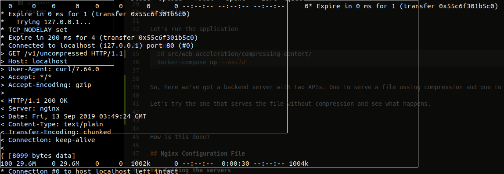
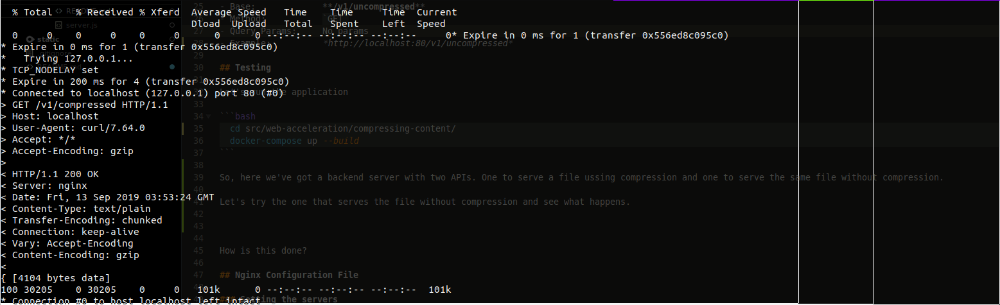

# Compression

The ngx_http_gzip_module module is a filter that compresses responses using the “gzip” method. This often helps to reduce the size of transmitted data by half or even more.

```
NOTE: When using the SSL/TLS protocol, compressed responses may be subject to BREACH attacks.
```
[BREACH Attack](https://en.wikipedia.org/wiki/BREACH)

[NGINX GZIP directives](http://nginx.org/en/docs/http/ngx_http_gzip_module.html)
[NGINX GUNZIP directives](http://nginx.org/en/docs/http/ngx_http_gunzip_module.html)

## Server APIs

#### Compressed File
Retrieves a plain text compressed file

- Base: 			**/v1/compressed**
- Method: 			`GET`
- Query Params:		No params
- Example: 			*http://localhost:80/v1/compressed*

#### Uncompressed File
Retrieves a plain text uncompressed file

- Base: 			**/v1/uncompressed**
- Method: 			`GET`
- Query Params:		No params
- Example: 			*http://localhost:80/v1/uncompressed*

## Testing

Let's run the application

```bash
  cd src/web-acceleration/compressing-content/
  docker-compose up --build
```

So, here we've got a backend server with two APIs. One to serve a file ussing compression and one to serve the same file without compression.

Let's try the one that serves the file without compression and see what happens.

```bash
	curl -H 'Accept-Encoding: gzip' http://localhost/v1/uncompressed --output $HOME/uncompressed -v
```




As we can see, the server sent the request to NGINX in 74 miliseconds and because of our "slow connection" (I simulated this by reducing the bandwidth with nginx as we will see later) it took 30 seconds to be delivered to us from NGINX. If we look into the curl response we will see a body of 29.6MB size.

Now let's try the compressed API

```bash
	curl -H 'Accept-Encoding: gzip' http://localhost/v1/compressed --output $HOME/compressed -v
```




This time, response took less than a second to be delivered to us. If we look into the curl response we will see the *Vary: Accept-Encoding* and *Content-Encoding: gzip* header in the response and a body of 30KB size aprox.

How is this done?

## Nginx Configuration File

### Setting the servers
Since we are working with HTTP protocol we need to open an http section and set the upstream servers. In our case we only have the backend server.

```nginx
http {
	upstream backend {
	    server compressing-content:4500;
	}

  ## More magic
}
```

Notice that the DNS of the server is "compressing-content" and is listening in port 4500. It is the name I've assigned to the backend service in the docker-compose file, and it only exists in the private network, also created in the compose file. It could also be an ip. As we said, the protocol is HTTP.

### Setting up compression

```nginx
  	server {
    	...

		## Compression settings
		# Enable compression
		gzip on;
		# Set the Vary: Accept-Encoding header to tell proxies and browsers that the content may be compressed or uncompressed
		gzip_vary on;
		# Compression level (6 is the default).
		gzip_comp_level 6;
		# Enables compression for all proxied requests.
		gzip_proxied any;
		# Sets the buffer for the compressed bodies
		gzip_buffers 32 4k;

		# Sets the MIME types to compress. (HTML is included by default)
		gzip_types
			text/css
			text/plain
			text/javascript
			application/javascript
			application/json
			application/x-javascript
			application/xml
			application/xml+rss
			application/xhtml+xml
			application/x-font-ttf
			application/x-font-opentype
			application/vnd.ms-fontobject
			image/svg+xml
			image/x-icon
			application/rss+xml
			application/atom_xml;

		# Sets the minimum length of a request to be compressed.
		gzip_min_length 256;

		# Enables or disables decompression of gzipped responses for clients that lack gzip support.
		gunzip on;

		location /v1/compressed {
		  # Simulating slow connections
		  limit_rate 1024k;
		  ## Server url (The one set in the upstream section)
		  proxy_pass          http://backend;
		}

		location /v1/uncompressed {
		  # Simulating slow connections
		  limit_rate 1024k;
		  ## Server url (The one set in the upstream section)
		  proxy_pass          http://backend;
		  ## Deactivating compression for this location
		  gzip                off;
		}
	}
```

The first directive to look at is `gzip on`. This is telling NGINX to enable gzip compression. The second one is `gzip_comp_level 6` which is set to its default. Possible values for this directives goes from 1 to 9, as the level grows the response gets smaller at the expense of additional CPU. Six is a pretty good number as it guarantees a high compressed body. Taking it to nine will not give us more than a 10% size improve while would level up the CPU usage exponentially.

`gzip_types` is a very important directive to take into consideration. **We must make sure that our data is compressible**, not all data types are, and some of them are already compressed like *jpg*. Trying to recompress data will only lead to slow down our responses.

`gzip_min_length` directive sets the minimun length of the body to be compressed. **Compressing small responses may have a negative impact in performance.**

### Directive gzip_vary

This directive enables or disables inserting the “Vary: Accept-Encoding” response header field if the directives gzip, gzip_static, or gunzip are active.
The Vary HTTP response header determines how to match future request headers to decide whether a cached response can be used rather than requesting a fresh one from the origin server. It is used by the server to indicate which headers it used when selecting a representation of a resource in a content negotiation algorithm.
When using the Vary: User-Agent header, caching servers should consider the user agent when deciding whether to serve the page from cache or not. For example, if you are serving different content to mobile users, it can help you to avoid that a cache may mistakenly serve a desktop version of your site to your mobile users.
In our case we need this header to tell the caches that they should take into consideration the encoding of the response. **We don't want our client to receive a compressed response when they are not able to decompress it.**
